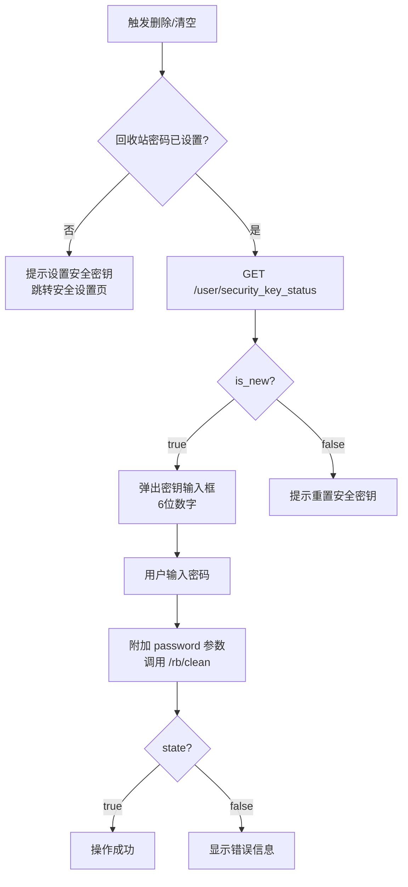

# 115回收站 API 文档

## 概述

115网盘的回收站功能通过一组 REST API 实现，支持列出、还原、彻底删除和清空回收站中的文件。

文件移入回收站后保留 **30 天**，到期自动清理。彻底删除和清空操作需要 **6 位安全密钥**。

---

## API 接口

### 1. 获取回收站列表 `/rb`

```
GET https://webapi.115.com/rb
```

| 参数 | 类型 | 必填 | 说明 |
|------|------|------|------|
| `aid` | number | 是 | 空间 ID，回收站固定为 `7` |
| `cid` | number | 否 | 原目录 ID，`0` 为根目录 |
| `offset` | number | 否 | 偏移量，默认 `0` |
| `limit` | number | 否 | 每页数量，默认 `115` |
| `order` | string | 否 | 排序字段，默认 `dtime`（删除时间） |
| `asc` | number | 否 | 是否升序，`0` 降序 `1` 升序，默认 `0` |
| `source` | string | 否 | 来源 |
| `format` | string | 否 | 格式，默认 `json` |

**请求示例**:

```
GET /rb?aid=7&cid=0&offset=0&limit=115&source=&format=json
```

**响应**:

```json
{
  "state": true,
  "error": "",
  "count": "42",
  "offset": 0,
  "page_size": 115,
  "order": "dtime",
  "is_asc": 0,
  "rb_pass": 0,
  "data": [
    {
      "id": "3466995015190840819",
      "file_name": "twitch_video_2676854744.mp4",
      "type": "1",
      "file_size": "8554345579",
      "dtime": "1783314012",
      "status": "0",
      "cid": 0,
      "parent_name": "根目录",
      "iv": 1,
      "vdi": 4,
      "ico": "mp4",
      "u": "",
      "play_long": 9334
    }
  ]
}
```

**`data[]` 字段说明**:

| 字段 | 类型 | 说明 |
|------|------|------|
| `id` | string | 回收站文件 ID |
| `file_name` | string | 文件名 |
| `type` | string | `"1"` 文件，`"2"` 文件夹 |
| `file_size` | string | 文件大小（字节） |
| `dtime` | string | 删除时间（Unix 时间戳） |
| `status` | string | `"0"` 正常，`"-1"` 文件夹还原中 |
| `cid` | number | 原目录 ID，`0` 为根目录 |
| `parent_name` | string | 原目录名称 |
| `iv` | number | 是否视频，`1` 是 |
| `vdi` | number | 视频清晰度 (1-5, 100) |
| `ico` | string | 文件后缀名 |
| `u` | string | 缩略图 URL |
| `play_long` | number | 播放时长（秒） |

---

### 2. 移入回收站（软删除） `/rb/delete`

```
POST https://webapi.115.com/rb/delete
Content-Type: application/x-www-form-urlencoded
```

| 参数 | 类型 | 必填 | 说明 |
|------|------|------|------|
| `pid` | string | 是 | 父级目录 ID |
| `fid[0]` | string | 是 | 文件/目录 ID（索引从 0 开始） |
| `fid[1]` | string | 否 | 第二个文件 ID |
| `ignore_warn` | 1 | 否 | 忽略删除警告 |

**请求示例**:

```
pid=3013116589290552633&fid[0]=3460275804229863111&fid[1]=3460273038497417148&ignore_warn=1
```

**响应**:

```json
{
  "state": true,
  "error": "",
  "errno": ""
}
```

**错误码**:

| errno | 说明 |
|-------|------|
| `800007` | 删除警告（可通过 `ignore_warn=1` 绕过） |

---

### 3. 还原文件 `/rb/revert`

```
POST https://webapi.115.com/rb/revert
Content-Type: application/x-www-form-urlencoded
```

| 参数 | 类型 | 必填 | 说明 |
|------|------|------|------|
| `rid[0]` | string | 是 | 回收站文件 ID（索引从 0 开始） |
| `rid[1]` | string | 否 | 第二个文件 ID |

不校验安全密钥，直接还原。

**请求示例**:

```
rid[0]=3466995015190840819
```

**响应**:

```json
{
  "state": true,
  "error": "",
  "errno": ""
}
```

**错误码**:

| errno | 说明 |
|-------|------|
| `300001` | 网盘空间不足，需释放空间或扩容 |
| `4500032` | VIP 功能限制，需升级 VIP |

---

### 4. 彻底删除文件 `/rb/clean`（按文件）

```
POST https://webapi.115.com/rb/clean
Content-Type: application/x-www-form-urlencoded
```

| 参数 | 类型 | 必填 | 说明 |
|------|------|------|------|
| `rid[0]` | string | 是 | 回收站文件 ID（索引从 0 开始） |
| `password` | string | 是 | 6 位数字安全密钥 |

**请求示例**:

```
rid[0]=3460275804229863111&password=947694
```

**响应**:

```json
{
  "state": true,
  "error": "",
  "errno": ""
}
```

---

### 5. 清空回收站 `/rb/clean`（清空全部）

```
POST https://webapi.115.com/rb/clean
Content-Type: application/x-www-form-urlencoded
```

不传 `rid` 参数即为清空全部。

| 参数 | 类型 | 必填 | 说明 |
|------|------|------|------|
| `password` | string | 是 | 6 位数字安全密钥 |

**请求示例**:

```
password=947694
```

---

### 6. 文件属性 `/rb/rb_info`

```
GET https://webapi.115.com/rb/rb_info
```

| 参数 | 类型 | 必填 | 说明 |
|------|------|------|------|
| `rid` | string | 是 | 回收站文件 ID |

---

## 安全密钥验证流程



1. 系统调用 `GET //passportapi.115.com/app/1.0/web/8.2/user/security_key_status` 检查安全密钥状态
2. 若 `is_new=true`，加载 `superpwd.page.html` 弹出密钥输入框
3. 用户输入 6 位数字密码后，附加 `password` 参数完成操作

---

## 业务流程图

```
          ┌──────────────┐
          │   网盘文件    │
          └──────┬───────┘
                 │ POST /rb/delete (软删除)
                 ▼
          ┌──────────────┐
          │    回收站     │ ← GET /rb (列表)
          │  (保留30天)   │
          └──────┬───────┘
                 │
        ┌────────┼────────┐
        │        │        │
        ▼        ▼        ▼
  POST /rb/  POST /rb/  到期自动
  revert     clean       清理
  (还原)    (彻底删除)
```

---

## 代码定位

- **JS 源码**: `rb.js` — UI 列表渲染，事件绑定 `restore`/`delete_rb`/`clear`
- **Core 逻辑**: `core-min.js` — `FileAjax.RestoreRB` / `DeleteRB` / `ClearRB` / `_rbPassWord`
- **密码弹窗**: `superpwd.page.html` / `superpwd.common.html`
